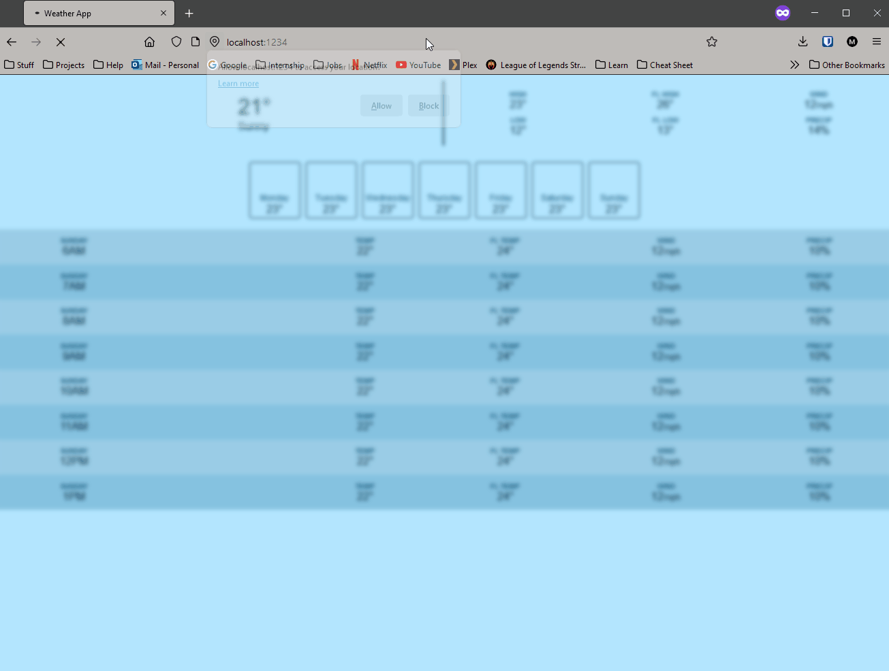

# Weather App
This is a Full Functioning Weather App.

## Table of contents

- [Overview](#overview)
  - [The Project](#the-project)
    - [Funtionality](#funtionality)
    - [Run](#run)
  - [Screenshot](#screenshot)
- [My process](#my-process)
  - [Built with](#built-with)
  - [What I learned](#what-i-learned)
  - [Useful resources](#useful-resources)
- [Author](#author)
- [Acknowledgments](#acknowledgments)

## Overview

### The Project
The project is built using HTML, CSS, JavaScript on the client side, with the server, built using Express/Node.js, making api calls to openweathermap's api.

#### Functionality:
The app using users current location and openweathermap's api to give user:
 - Current Days Weather Forcast
 - 7 Weather Forcast
 - 3 Day Hour by Hour Forcast

#### Run
To Run the project, first install the packages using `npm install` then run `npm run start` to run the project.
- Client: To run the client go to client folder then type `npm run start`.
- Sever: To run the server go to server folder then type `npm run start`.

### Screenshot

## My process

### Built with

- Semantic HTML5 markup
- CSS custom properties
- JavaScript
- Node.js
- [Axios](https://axios-http.com/) - Promise-based HTTP Client for node.js
- [Express](https://expressjs.com/) - Node.js Framework
- [Parcel](https://parceljs.org/) - Build Tool

### What I learned

I Learned how to build a server using Express.
I learned how to make api calls using Axios.

### Useful resources

- [Web Dev Simplified Js Course](https://javascriptsimplified.com/) - This helped me for build the project, by teaching me advanced js priciples and concept.

## Author

- Website - [Mondara](https://mondarathotage.com/)
- Linkedin - [@Mondara](https://www.linkedin.com/in/mondara-thotage/)
- Github - [@Mondara](https://github.com/Mondara)

## Acknowledgments

This project was built with the help of Web Dev Simplified Advanced JavaScript Course.

